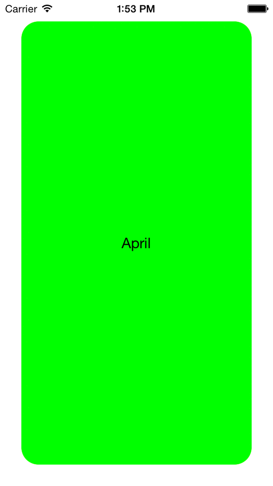

# CardSlide

##Swipe Down
 
***

##Swipe Up

***

Features
==================
- Simple swipe up and swipe down just like sliding a card to change the views.
- Max 3 views loaded at a time.
- 1 view loads on a single slide.
- Works on Autolayout!
- Seperate [`CardView.xib`](CardSlide/CardSlide/CardView.xib) for designing your UI in it. Just plug and play!

Usage
==================
- Include the following in your project:
  CardView.h, CardView.m, CardView.xib, ViewController.h & ViewController.m
- Use CardView class to design your UI.
- ViewController class handles the loading of CardView.
- Keep your data in _arrPageData in viewDidLoad.
- Set your data into CardView in setDataInView:forIndex method.

Using this?
==================
Kindly let me know! 
Will be glad to link your project here.

***

MIT License
==================
Copyright (c) 2015 Rahul Pant. All rights reserved.

Permission is hereby granted, free of charge, to any person obtaining a
copy of this software and associated documentation files (the "Software"),
to deal in the Software without restriction, including
without limitation the rights to use, copy, modify, merge, publish,
distribute, sublicense, and/or sell copies of the Software, and to
permit persons to whom the Software is furnished to do so, subject to
the following conditions:

The above copyright notice and this permission notice shall be included
in all copies or substantial portions of the Software.

THE SOFTWARE IS PROVIDED "AS IS", WITHOUT WARRANTY OF ANY KIND, EXPRESS
OR IMPLIED, INCLUDING BUT NOT LIMITED TO THE WARRANTIES OF
MERCHANTABILITY, FITNESS FOR A PARTICULAR PURPOSE AND NONINFRINGEMENT.
IN NO EVENT SHALL THE AUTHORS OR COPYRIGHT HOLDERS BE LIABLE FOR ANY
CLAIM, DAMAGES OR OTHER LIABILITY, WHETHER IN AN ACTION OF CONTRACT,
TORT OR OTHERWISE, ARISING FROM, OUT OF OR IN CONNECTION WITH THE
SOFTWARE OR THE USE OR OTHER DEALINGS IN THE SOFTWARE.

### Author

Rahul Pant ([@deviserRahul](https://github.com/deviserRahul))
